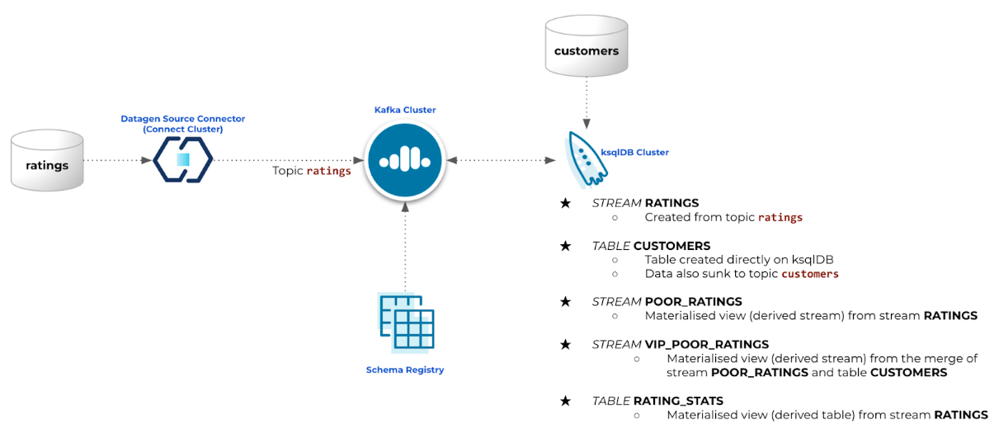

# How to build streaming applications with Confluent Cloud (step-by-step guide)
[ksqlDB](https://www.confluent.io/product/ksqldb) is the streaming SQL engine for Apache Kafka.

This guide will step through some practical examples of how to use [Confluent Cloud](https://www.confluent.io/confluent-cloud/) and ksqlDB to build powerful real-time stream-processing applications:

- Quickly build your environment and clusters using Confluent Cloud
- [Datagen source connector](https://docs.confluent.io/cloud/current/connectors/cc-datagen-source.html) to generate dummy/test data
- ksqlDB to filter streams of data and join live streams of events with reference data (e.g. from a database)  
- Continuous, stateful aggregations

## Step by step guide
Open the PDF guide at <a href="https://github.com/ifnesi/ksqldb-cc-workshop/blob/main/Workshop%20How%20to%20build%20streaming%20applications%20with%20Confluent%20Cloud%20(step-by-step%20guide).pdf">Workshop How to build streaming applications with Confluent Cloud (step-by-step guide).pdf</a> and follow it along.